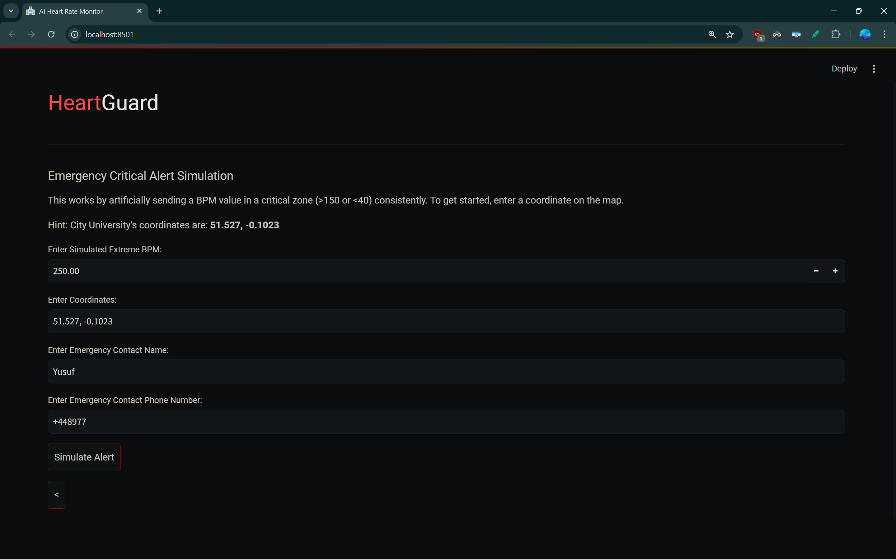
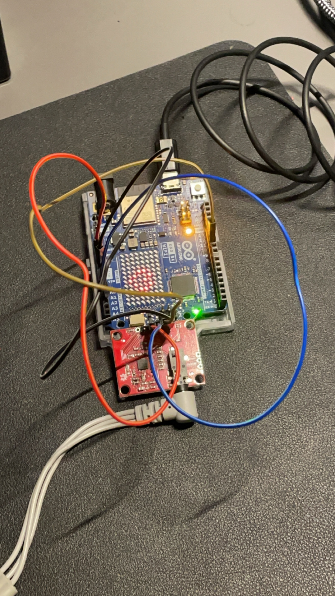
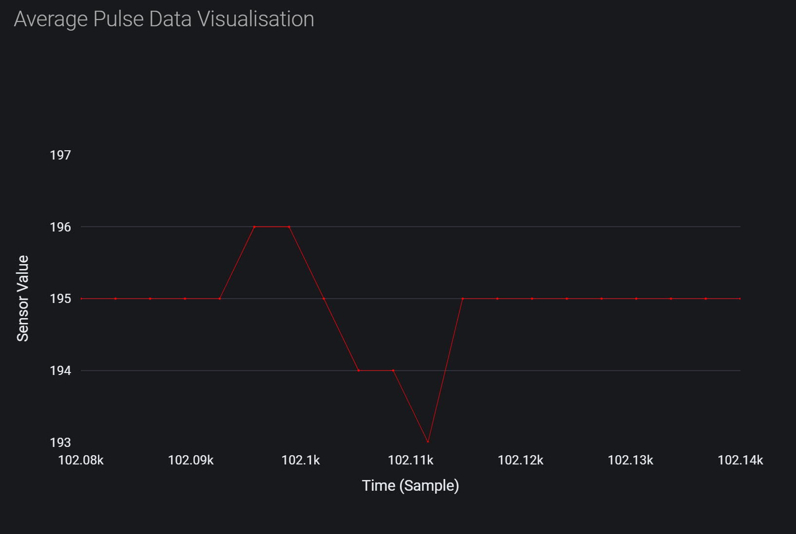

# HeartGuard: AI-driven Emergency Alert Medical Intervention Platform

## Overview
<b>HeartGuard<b> is an autonomous, AI-driven emergency alert medical intervention platform designed to provide accurate and reliable patient diagnostics for vulnerable individuals exhibiting signs of heart disease. Developed during a 48-hour hackathon hosted by City Robotics Society (UoL), the project features both a physical prototype for heartbeat detection and a fully functional AI-powered diagnostics web application.

## Demonstration

<br></br>

<br></br>

<br></br>

<br></br>

<br></br>

## Description

HeartGuard uses a **3-point ECG sensor module** integrated with an **Arduino Uno R4 Wi-Fi** to detect heart rate and monitor for critical heart events. When a critical heart rate is detected, the system sends an automated alert and emergency call via **Twilio API**, notifying healthcare providers or first responders.

The platform also includes an AI-powered diagnostics system, leveraging **OpenAI GPT-4 & 3.5 Turbo** for generating structured medical reports and personalized healthcare recommendations. The system reduces manual effort by 80% and aims to improve response times for emergency medical intervention by around **2 minutes**.

## Features

- **Heartbeat Detection Prototype**: Using an Arduino Uno R4 Wi-Fi and a 3-point ECG sensor with gel-based electrodes to detect heart rate with 15% more accuracy than standard 1-point ECG devices (like Apple Watches).
- **AI Diagnostics**: Integration with OpenAI’s GPT-4 & 3.5 Turbo to generate medical reports and healthcare recommendations automatically, reducing manual effort by 80%.
- **Autonomous Emergency Alerts**: Automated system using **Twilio API** to send alerts and initiate emergency calls during critical heart rate events, pinging the patient's location for swift intervention.
- **Full-stack Web Application**: Built using Python, NumPy, and Plotly to visualize heart rate data and provide diagnostics for 20+ simulated users.
- **Twilio Integration**: Use of Twilio Voice API and Webhooks for reliable backend systems that achieve 95% reliability in alert simulations.

## Technologies Used

- **Hardware**: Arduino Uno R4 Wi-Fi, 3-point ECG sensor, Gel-based Electrodes
- **Software**: Python, C++, OpenAI GPT-4 & 3.5 Turbo, Twilio API, Plotly, NumPy
- **Web Development**: Full-stack Python application with a professional UI

## Getting Started

### Prerequisites

- Arduino IDE for uploading code to Arduino Uno R4
- Python 3.x
- Twilio Account (for API keys)
- Git

### Installation

1. Clone the repository:
   ```bash
   git clone https://github.com/yusuf-s-ahmed/heartguard.git
